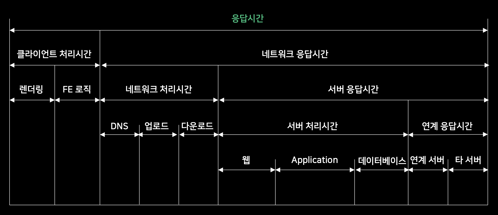

# 성능 테스트

## 성능 테스트 목적

- 스프트웨어 성능 평가
- 신규 버전 출시 준비 상태 점검
- 인프라/시스템 아키텍처 성능 검증
- 성능 튜닝을 통한 효율 향상 점검

## 성능 테스트 주요 용어

- Transaction
    - 시간 당 처리율을 나타내는 지표의 기준
- 동시 사용자(Concurrent User)
    - 시스템과 접속을 유지하고 있는 사용자 수
    - 요청 사용자(Active User): 서버에 요청 후 응답 대기 상태 사용자
    - 비요청 사용자(Inactive User): 서버에 요청을 보내고 있지 않은 사용자 (예. 화면의 내용을 읽는 중)
- 처리량(Throughput)
    - 시스템이 일정 시간 내에 처리 가능한 Transaction 수
        - 평가 단위
            - TPS = Transaction Per Second
            - PPS = Page Per Second
- 응답시간(Response time)
    - 요청 한 후 부터 응답을 받을 때 까지 소요된 시간
    - 

## 성능 테스트 절차

1. 테스트 환경 파악
    - 테스트/운영환경(예. h/w, s/w, 네트워크 환경, ...)
    - 테스트 도구
2. 요구되는 성능 기준 파악
    - 응답 시간
    - 시스템 사용률(예. cpu, memory, ...)
3. 테스트 계획 수립
    - 주요 시나리오 정리
    - 테스트 데이터 정의
    - 측정 결과 데이터 정의
4. 테스트 환경 설정
    - 테스트 환경/도구 준비(예. nGrinder, JMeter, ...)
    - 리소스(서버) 모니터링 환경 준비
5. 테스트 구현
    - 테스트 시나리오에 따른 구현(예. nGrinder 스크립트 작성)
6. 테스트
    - 테스트 실행 및 모니터링
7. 분석 및 리포트
    - 결과/지표 데이터 분석
    - (필요하다면) 반복 테스트
