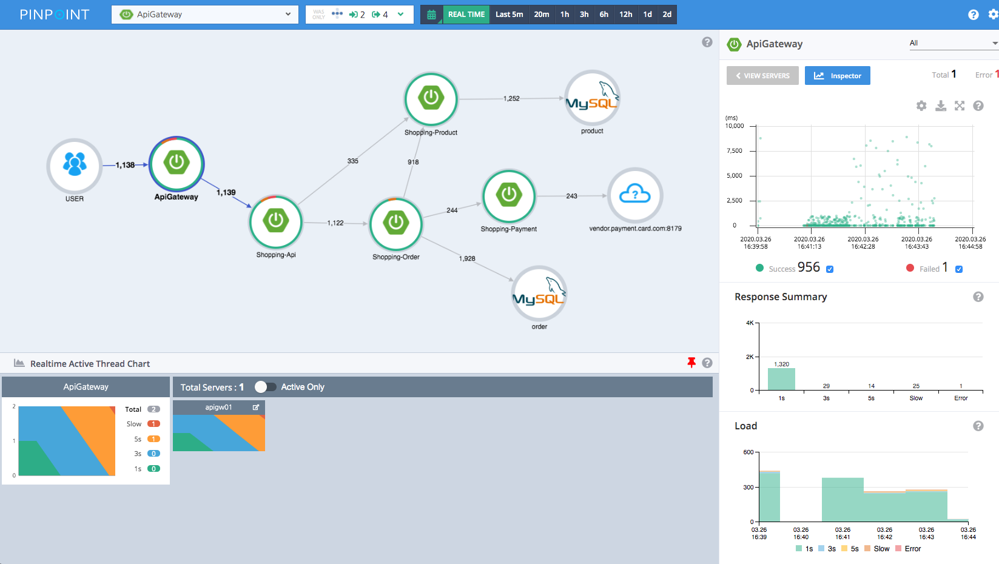
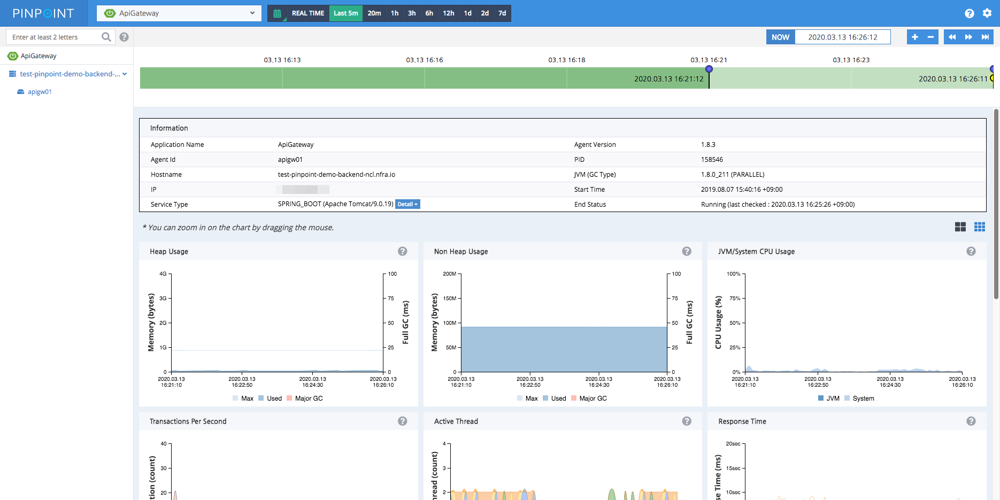
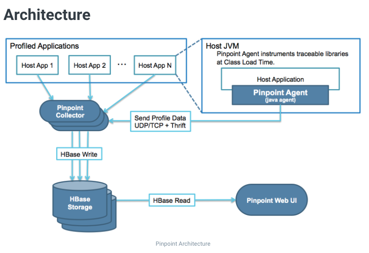
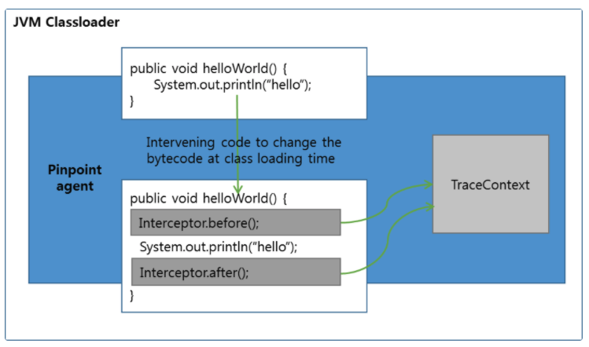

# Pinpoint

[pinpoint](https://github.com/pinpoint-apm/pinpoint) 는 large-scale distributed systems(대규모 분산 시스템)을 위한 APM(
Application Performance Management) 도구이다.  
2012년부터 꾸준히 개발되어 2015년에는 오픈소스화됐다.

## Overview

오늘날 서비스는 대부분 monolithic 아키텍처의 구조를 넘어 여러 컴포넌트들간의 상호작용으로 서비스를 제공하는 구조인 microservice 아키텍처 구조로 이루어져있다. 이런 구조에서 요청이
처리되기까지의 과정은 블랙박스처럼 여겨진다. Pinpoint와 같은 APM 도구는 이러한 구성 요소 간의 흐름을 추적하고 문제 영역과 잠재적인 병목 현상을 식별하기 위한 데이터를 제공한다.

- ServerMap: 구성 요소들이 상호 연결된 방식을 시각화하여 분산 시스템의 topology를 이해할 수 있게 도와준다. 노드를 클릭하면 현재 상태 및 트랜잭션 수와 같은 세부 정보를 확인할 수
  있다.
- Realtime Active Thread Chart: 실시간으로 애플리케이션 내부의 active 스레드를 모니터링할 수 있다.
- Request/Response Scatter Chart: 시간 경과에 따른 요청 수 및 응답 패턴을 시각화하여 잠재적인 문제를 식별한다.
    - 
- Callstack: 분산 환경의 모든 트랜잭션에 대한 코드 수준의 가시성을 확보하고 병목 지점과 실패 지점을 식별한다.
    - 
- Inspector: CPU 사용량, 메모리/GC, TPS 및 JVM arguments 같은 추가 세부 정보를 확인할 수 있다.
    - 

## Architecture

모니터링하고자 하는 애플리케이션의 해당 언어의 Agent를 붙이면 Agent가 애플리케이션으로부터 데이터를 수집해서 Pinpoint collector에 전송하고 필요에 따라 가공하여 HBase에
저장한다.  
Pinpoint web은 HBase로부터 데이터를 읽어 필요한 정보를 유저에게 제공한다.

Java의 경우에는 Byte Code Instrumentation을 사용하여 자동으로 정보를 수집한다. Java와 Node-js를 제외하고는 SDK 형식으로 제공되어 사용자가 직접 모니터링 포인트를
지정해야한다.

### Byte Code Instrumentation

1. 클래스 로딩 시간에 애플리케이션 코드에 추적을 위한 코드를 개입시켜 정보를 수집한다.
2. 애플리케이션에 코드를 직접 추가할 필요가 없다.

### Overload

중간중간에 정보를 수집하기 때문에 모니터링을 하고 있는 애플리케이션의 성능에 영향을 준다. Pinpoint를 사용함으로써 영향을 받는 성능은 사용하지 않을때와 비교하여 3% 정도이다. 즉
Pinpoint로 인하여 성능에 영향을 받는 부분은 크지 않다고 볼 수 있다.
