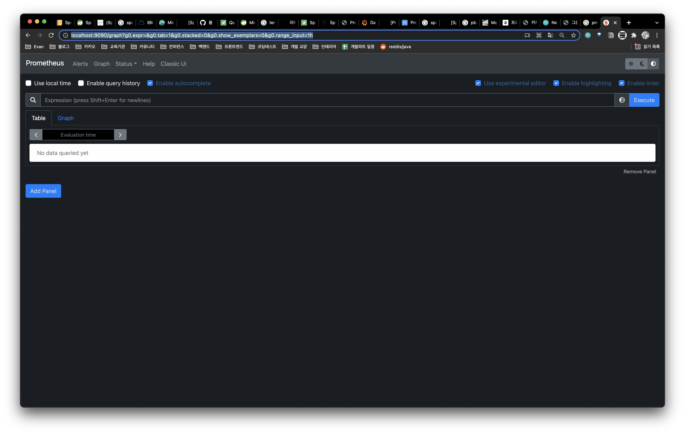

# 실습

`Prometheus`를 이용해 `Spring Boot` 메트릭을 수집하고 `Grafana`로 시각화하는 실습한다.


**목차**

1. Java Metrics
2. Prometheus
3. Grafana
4. 실습


## Java Metrics

`Spring Boot Actuator`는 Spring Boot 애플리케이션의 정보들을 수집한다.

수집된 정보를 확인하기 위한 방법으로 `JMX Exporter` 또는 `HTTP Endpoint` 형태로 제공한다.

> ⚠️ Spring Boot 2 이상 버전에서 지원한다.


### Http Endpoint

`Actuator`는 `info`, `logger`, `env`, `health` 등 많은 기능을 제공하지만 여기서는 `prometheus` 엔드포인트를 사용한다. 이름 그대로 Prometheus 서버가 지표를 수집할 수 있도록 애플리케이션 지표를 Prometheus 포맷으로 expose한다.이 엔드포인트는 평범한 HTTP API이기 때문에 직접 요청해서 데이터를 확인해볼 수도 있다.


#### Dependencies

`Spring Boot Actuator`는 물론 필요하며 추가적으로 **Micrometer Registry**가 필요하다.

**build.gradle**

```groovy
dependencies {
  // Required
  implementation 'org.springframework.boot:spring-boot-starter-actuator'
  runtimeOnly 'io.micrometer:micrometer-registry-prometheus'
  
  // Optional
  implementation 'org.springframework.boot:spring-boot-starter-web'
}
```

의존성 설정을 위와 같이 해준 후 `Spring Actuator`로 메트릭들을 Prometheus가 가져갈(Pull)수 있도록 Http EndPoint를 노출시킨다. 그 설정은 아래와 같다.


##### **Micrometer**

> Think SLF4J, but for metrics.

Micrometer의 목적은 지표 수집의 추상화이다. SLF4J로 로그를 남기듯 동일한 인터페이스로 지표를 측정하고, 서로 다른 모니터링 플랫폼에서 수집이 가능하도록 도와준다.

범용 지표 측정 라이브러리로서, Spring Boot 2 버전부터 Spring Boot Actuator의 근간을 이루는 핵심 라이브러리이다. 때문에 Micrometer Core는 이미 Spring Boot Actuator에 포함되어있다.


##### Micrometer Registry

이때 Micrometer로 측정된 지표를 실제 백엔드에 저장하는 기능을 구현한 것이 **Micrometer Registry**이다.

Spring Boot Actuator는 의존성에 어떤 Micrometer Registry가 포함되었는지 확인하고, 감지된 Registry에 맞춰서 AutoConfiguration을 수행한다.

현재 Prometheus, Elastic, InfluxDB, Dynatrace 등 많은 registry를 제공하고 있으며 전체 목록은 [링크](https://micrometer.io/docs)에서 확인할 수 있다.


**application.yml**

```yml
spring:
  application:
    name: demo-spring-web-app
management:
  endpoints:  
    web:
      exposure:
        include: "prometheus" # expose 할 endpoint 설정
  metrics:
    tags:
      application: ${spring.application.name}
```

- endpoints.web.exposure.include
  - expose 할 endpoint를 설정한다. prometheus에서 pull을 통해 가져갈 endpoint를 설정한다.
  - 해당 endpoint는 이미 micrometer registry prometheus에 의해 감지되어 만들어져있다.
- metrics.tags.application
  - 필수는 아니지만 각 애플리케이션 서비스를 구분하기 위한 태그(Micrometer의 tag)를 추가하는 것을 권장한다.
  - 일반적으로 태그 이름은 `application`으로, 태그 값은 Spring Boot의 `spring.application.name` 속성을 사용한다. `management.metrics.tags.<key>: <value>`에 입력된 태그는 모든 지표에 추가될 것이며, Prometheus 포맷으로 변환시 모든 지표의 레이블에 추가된다.


이제 서버를 띄우면 아래의 URL을 통해서 `/actuator/prometheus` endpoint 에서 수집한 지표를 확인할 수 있다.

```
http://localhost:8080/actuator/prometheus
```


### JMX Exporter

Spring Boot의 경우 자체적으로 Prometheus를 지원하여 편리하게 사용할 수 있다. 마찬가지로 많은 플랫폼, 프레임워크, 라이브러리가 Prometheus를 지원하지만 그렇지 않은 경우도 많이 존재한다. 그런 경우, [JMX Exporter](https://github.com/prometheus/jmx_exporter)를 사용할 수 있다.

이름 그대로 JMX Exporter는 Java 애플리케이션의 JMX에서 제공하는 지표를 Prometheus 포맷으로 변경하여 Prometheus가 수집할 수 있도록 도와준다. 어떤 JMX Bean을 지표로 사용할 것인지, 어떤식으로 값을 추출하고 어떤 이름으로 사용할 것인지 등 JMX를 Prometheus 포맷으로 가공하는데에는 정규표현식을 사용한다.

유명한 Java 프로젝트는 설정을 미리 [프리셋](https://github.com/prometheus/jmx_exporter/tree/master/example_configs)으로 만들어서 제공하고 있다.

JMX Exporter는 일반적으로 JVM agent 방식으로 사용한다. 아래와 같은 JVM 옵션을 실행할 애플리케이션에 추가해야한다. 아래와 같이 설정하면 `config.yml`파일을 참고하여 모니터링할 JMX를 Prometheus 포맷으로 변환하고 HTTP `/metrics` 엔드포인트를 8080 포트로 등록한다.

```bash
java -javaagent:./jmx_prometheus_javaagent-0.12.0.jar=8080:config.yaml -jar my_app.jar
```

JMX를 사용함으로서 실질적으로 거의 모든 Java 애플리케이션을 모니터링할 수 있다.


## Prometheus

2012년에 처음으로 모습을 드러낸 오픈소스 모니터링 플랫폼이다. 기존의 다른 모니터링 플랫폼과는 다르게 Pull 방식을 사용하여 수집한다. Prometheus client 또는 Exporter가 메트릭을 scrape 해간다.


### 설치 및 실행

간단하게 도커 컨테이너로 Prometheus Server 를 띄워보도록 한다.

Prometheus Server는 기동시 `/etc/prometheus/prometheus.yml` 설정 파일을 사용한다. docker volume mount를 이용해 Prometheus Server에서 사용할 설정 `prometheus.yml` 파일을 만들어보자.

앞에서 언급했듯 Prometheus는 Pull 방식의 수집 방법을 사용하고 있어 직접 각 모니터링 대상에게 HTTP 요청을 하여 지표 데이터를 가져간다. 그래서 Promeheus에 모니터링 대상의 주소를 등록할 필요가 있다.

만약 Service Discovery와 연동이 되어있다면 자동으로 새로운 대상을 발견하고 모니터링을 시작하겠지만 실습에 사용될 최소설정에는 그런 설정이 없으므로 직접 손으로 입력이 필요하다.

``` bash
scrape_configs:
  - job_name: 'spring-actuator'
    metrics_path: '/actuator/prometheus' # metric을 수집할 endpoint
    scrape_interval: 5s # 스크랩 인터벌 설정
    static_configs: 
    - targets: ['host.docker.internal:8080'] # 타겟 어플리케이션 설정
```

> ❓ **host.docker.internal**
>
> docker에서 `host.docker.internal`은 특별한 DNS name으로 사용되며 docker를 실행하는 host를 가리킨다. 개발용으로만 사용해야 하며, Docker Desktop(Mac) 외부의 환경에서는 동작하지 않는다.
>
> https://docs.docker.com/desktop/mac/networking/


파일 생성을 완료했다면 prom/prometheus 이미지를 이용해 docker로 prometheus를 실행한다.

```bash
❯ docker run -d \
	--name=prometheus \
	-p 9090:9090 \
	-v /Users/addpage/prometheus/prometheus.yml:/etc/prometheus/prometheus.yml \
	prom/prometheus \
	--config.file=/etc/prometheus/prometheus.yml
```


모니터링 지표 수집을 위한 기본적인 준비는 완료되었다.
브라우저를 통해서 `localhost:9090`에 접속하여 아래와 같은 Prometheus 웹 화면이 확인되면 된다.



이 웹 화면에서 Prometheus의 조회 쿼리를 테스트해볼 수 있고 추가적인 설정을 통해서 지표 기록 및 알림 상태 등을 확인할 수 있다. 하지만 이 Prometheus 웹 화면을 사용할 일은 거의 없다. Grafana라는 훌륭한 오픈소스 대시보드가 있기 때문이다.


## Grafana

다양한 데이터소스로부터 데이터를 가져와 대시보드를 구성할 수 있도록 돕는 오픈소스 플랫폼이다.

> ❓ **그라파나가 말하는 데이터 소스란**
>
> 일반적으로 Grafana에서 말하는 데이터소스는 실제 시계열 지표 성격의 데이터를 저장하고 조회할 수 있는 플랫폼. 지원하는 데이터소스의 목록은 [Grafana Docs](https://grafana.com/docs/grafana/latest/datasources/)에서 확인


### 설치 및 실행

Grafana 역시 도커를 통해 띄우자.

```
$ docker run -d --name=grafana -p 3000:3000 grafana/grafana
```


브라우저를 통해서 `http://localhost:3000`으로 접속하면 Grafana 로그인 페이지를 볼 수 있다.  

기본 관리자 계정은 `ID: admin`, `PW: admin`이다. 로그인에 성공하면 Grafana에서 다음 단계를 위한 가이드를 보여줄 것이다.


#### Add Prometheus Data Source

왼쪽 사이드메뉴의 `Configuration > Data sources > Add data source` 버튼을 클릭하여 데이터 소스 추가 화면으로 넘어간 후 `Time series databases` 탭에서 `Prometheus` 선택해주자.


원하는 이름으로 `Name` 필드를 작성하고 아래 HTTP 탭의 `URL` 필드에서는 조금 전에 설치하여 실행한 Prometheus의 URL을 입력한다. Save & Test 후 별 문제가 없다면 Success 가 될 것이다.


이렇게 간단하게 Prometheus와 Grafana를 연동할 수 있었다. 제대로 동작하는지 확인을 위해서 새로 대시보드를 생성하여 차트를 만들어볼 수 있다.

하지만 현재 모니터링하고 있는 애플리케이션이 없기 때문에 애초에 차트로 만들 것이 없다.


## 실습

### PromQL로 지표 조회

Prometheus는 지표를 조회하기 위한 PromQL(Prometheus Query Language)이라는 쿼리 언어를 제공한다. SQL처럼 수집된 지표를 필터링 및 집계할 수 있으며, 또한, 가공하고 알림을 발생시키는데 사용할 수 있다.

그리고 중요한 점은 Prometheus의 모니터링 대상이 expose하는 지표 데이터는 이전 수집 시기로부터의 변화량이 아니라 앱 실행시부터 누적된 값이다.

지표의 변화량은 서버에서 조회시 PromQL을 통해서 계산할 수 있으며, `rate`, `irate` 같은 함수가 그 역할을 수행한다.


#### 예제

- 특정 서비스내 인스턴스의 JVM Heap Eden 영역 조회

  ```
  jvm_memory_used_bytes{instance="host.docker.internal:8080", application="demo-spring-web-app", id="G1 Eden Space"}
  ```

- 특정 서비스내 인스턴스의 API(Method + URL Path + Status Code)별 초 당 요청 수 조회
  - count 지표는 앱 시작시부터 계속 누적되는 값이기 irate 함수를 사용한다.

  ```
  irate(http_server_requests_seconds_count{instance="host.docker.internal:8080", application="demo-spring-web-app"}[3m])
  ```

- 특정 서비스의 초 당 에러 요청 수 총 합계 조회

  ```
  sum by (application) (irate(http_server_requests_seconds_count{application="demo-spring-web-app", outcome=~"CLIENT_ERROR|SERVER_ERROR"}[3m]))
  ```


### Grafana에 대시보드와 차트 생성

Marketplace 원하는 대시보드가 없거나 import 받은 대시보드에 원하는 그래프가 없다면 직접 그래프를 생성할 수 있다.

> ✏️ 이때 역시 PromQL이 사용된다.

