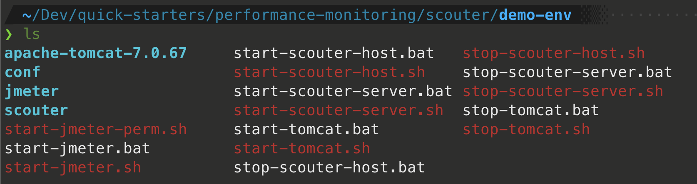

# Scouter Quick Start


scouter 구성을 그림으로 간단히 나타내면 위와 같다. 

| Modules           | 설명                                                         |
| ----------------- | ------------------------------------------------------------ |
| Server(Collector) | Agent가 전송한 데이터 수집/처리                              |
| Host Agent        | OS의 CPU, Memory, Disk등의 성능 정보 수집 후 전송            |
| Java Agent        | 실시간 서비스 성능 정보, Heap Memory, Thread 등 Java 성능 수집 후 정보 |
| Client(Viewer)    | 수집된 성능 정보를 확인하기 위한 Client 프로그램             |


## Requirement

- JDK 7+ (& JAVA_HOME 환경변수 설정)

  > ⚠️ JDK 9 이상부터 잘 동작되지 않는 것 같다. 

- Windows / Linux / OS X


## Quick Start 순서

1. 통합 데모 환경 및 클라이언트 프로그램 다운로드
2. 압축 파일 해제 - **이것으로 설치 완료!**
3. Scouter Server(Collector) 실행
4. Scouter Client(Viewer) 실행
5. Host Agent 실행
6. 모니터링 대상 애플리케이션 실행 (Tomcat with WAR)
7. **브라우저를 통해 데모 시스템(JPetStore) 접속**
8. jmeter를 통한 가상의 부하 발생하여 부하 테스트
9. 모니터링


### 1. 통합 데모 환경 및 클라이언트 프로그램 다운로드

- 통합 데모 환경 다운로드

  - [demo-env1.tar.gz 다운로드](https://github.com/scouter-project/scouter-demo/releases/download/v2.6.2/demo-env1.tar.gz) 

    - Collector Server
    - Host Agent
    - Java Agent
    - Tomcat
    - 샘플 시스템
    - 설정, 기동
    - ... 등 스크립트를 포함

    

- Client 다운로드

  - [scouter.client.product-macosx.cocoa.x86_64.tar.gz](https://github.com/scouter-project/scouter/releases/download/v2.6.2/scouter.client.product-macosx.cocoa.x86_64.tar.gz)

  

#### 압축 파일 해제

압축 파일을 해제 함으로써 기본적인 설치가 완료 된다. 다운로드 받은 demo-env1.tar.gz 를 적당한 위치에 압축 해제 한다.


#### Scouter Server(Collector) 실행


압축을 푼 위치에서 아래 명령 파일을 실행한다.

```
start-scouter-server.sh
```


#### Client(Viewer) 실행

다운로드 받은 Client를 압축 해제 후 실행한다.


Collector Server의 IP 를 `127.0.0.1:6100`, id/password를 admin/admin을 입력하여 로그인 한다.


#### Host Agent 실행

OS의 CPU, 메모리, IO등 자원 모니터링을 위한 Host Agent를 실행한다.

```
start-scouter-host.sh
```


#### 데모 시스템 실행(Tomcat with WAR)

```
start-tomcat.sh
```


#### 브라우저를 통해 데모 시스템 접속

브라우저를 실행하여 http://127.0.0.1:8080/jpetstore 에 접속하면 데모시스템이 실행되는 것을 볼수 있다. 또한 브라우저에서 요청을 발생시키면 Scouter Client에서 실시간으로(2초이내) 이를 확인할 수 있다. 


#### jmeter를 통한 가상의 부하 발생

모니터링이 잘 되는지 확인하기 위해 jmeter를 통해 가상의 부하를 발생시킬 수 있다. 아래와 같이 jmeter를 실행하면 5분간 부하가 발생된다. jmeter를 중지하기 위해서는 CTRL+C 를 누르면 된다.

```
start-jmeter.sh
```


## 참고

- [Scouter Quick Start](https://github.com/scouter-project/scouter/blob/master/scouter.document/main/Quick-Start_kr.md)